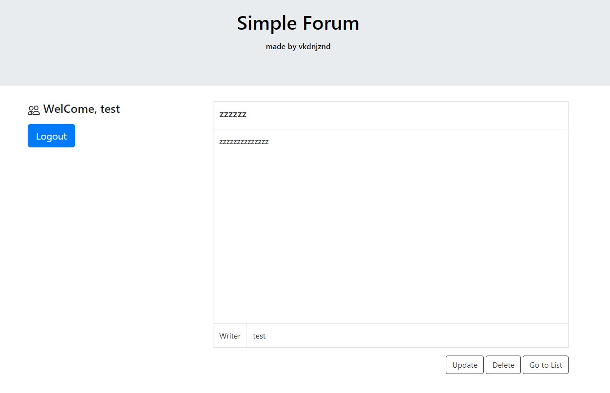

# SimpleForum

Simple General Forum is made using Flask, Bootstrap, HTML, Javascript      
This forum page have basic CRUD functions   
member register or login and write new a post, read, update, delete the post 

# Templates Preview
### This Pages are optimized for Chrome, Edge browser   

- ### Register
        Register process : Agree -> User input -> Finish

    
    
    

 

    <h3>Register create page have tooltips for notifying each input's rules</h3>
    

- ### Home
        In homepage, You can login and logout, or read posts.

    
    <h3>if you login success ↓</h3>
    

- ### Boards

    
    
    
    

# Security
- To prevent CSRF attack, apply CSRF Protect.
- To prohibit direct access, apply RegisterToken in Register agree step.

# Database
- Class Diagram

    
    
Use MySQL and SQLAlchemy

# Requirement
Check requirements.txt   

    bcrypt==3.2.0       
    cffi==1.14.4    
    click==7.1.2    
    Flask==1.1.2    
    Flask-Bcrypt==0.7.1
    Flask-SQLAlchemy==2.4.4
    Flask-WTF==0.14.3
    itsdangerous==1.1.0
    Jinja2==2.11.2
    MarkupSafe==1.1.1
    mysqlclient==2.0.3
    pycparser==2.20
    pycryptodomex==3.9.9
    PyMySQL==1.0.2
    six==1.15.0
    SQLAlchemy==1.3.22
    Werkzeug==1.0.1
    WTForms==2.3.3

# License
MIT License
